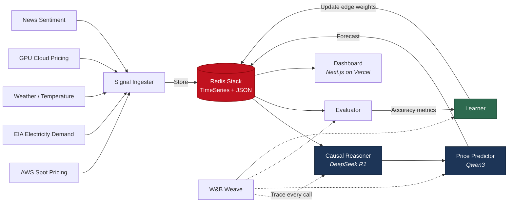

# The Compute Oracle

**A self-improving agent that predicts GPU compute cost fluctuations by tracking real-world causal factors.**

Every company running ML workloads is bleeding money on compute. Spot instance prices fluctuate based on real-world factors -- electricity demand, weather at data center locations, geopolitical events -- but nobody is connecting these signals to predict what happens next. Existing tools like Cast AI, nOps, and Revefi detect waste *after the fact*. The Compute Oracle **predicts the future**.

This agent ingests real-world signals, reasons causally about which factors drive GPU pricing, makes price predictions at multiple time horizons, and then *evaluates its own accuracy* to update its causal model. Over 78 evaluated cycles, it learned that **temperature at data center locations is the strongest predictor of spot price movement** -- a relationship it discovered on its own by strengthening and weakening edges in its causal graph.

Built for [WeaveHacks 3](https://weavehacks.com/) (January 31 -- February 1, 2026), targeting the **Best Self-Improving Agent** prize.

---

## What Makes This Different

| Existing tools | The Compute Oracle |
|---|---|
| **Reactive** -- detect waste after it happens | **Proactive** -- predict price dips before they occur |
| Use historical pricing patterns only | Use **exogenous causal factors**: weather, electricity demand, news sentiment |
| Static rules and thresholds | **Self-improving causal model** that learns which factors matter |
| No explanation of "why" | Full causal graph showing learned relationships |

The key insight: GPU spot prices are not random. They are downstream effects of measurable real-world signals. The Oracle learns which signals matter -- and gets better every cycle.

---

## How It Works

```
   Ingest          Reason           Predict         Evaluate         Learn
  --------       ---------        ---------       ----------       --------
  Real-world     LLM-based        Price           Compare          Update causal
  signals flow   causal           forecasts at    predictions      graph edge
  into Redis     reasoning        1h / 4h / 24h   vs ground        weights based
  TimeSeries     over factor      horizons via    truth when       on accuracy.
                 graph            Qwen3           it arrives       Repeat.
```



### The Self-Improvement Loop (step by step)

1. **Ingest** -- Pull real-time signals from 5 sources: AWS spot pricing, EIA electricity demand (PJM, ERCOT, CAISO grids), weather at data center locations (Virginia, Oregon), GPU cloud pricing, and news sentiment via web scraping.

2. **Reason** -- DeepSeek R1 (via W&B Inference) examines the causal factor graph and current signals to determine which factors are driving compute pricing right now, and in which direction.

3. **Predict** -- Qwen3 (via W&B Inference) produces price forecasts at 1-hour, 4-hour, and 24-hour horizons with confidence scores.

4. **Evaluate** -- When ground truth arrives, the evaluator compares predictions against actual prices. It calculates absolute error, directional accuracy, and identifies which contributing factors were correct or incorrect.

5. **Learn** -- The causal learner updates the graph:
   - Correct predictions **strengthen** edges: `w_new = w + alpha * (1 - w)`
   - Incorrect predictions **weaken** edges: `w_new = w * (1 - alpha)`
   - Adaptive learning rate: `alpha = 0.20` (early cycles) decaying to `0.05` (stable)
   - Edges below `0.05` weight are **pruned** -- the agent forgets irrelevant factors
   - Graph version increments each cycle

6. **Repeat** -- The next cycle uses the updated causal graph. Predictions get better.

---

## Key Results (78 evaluated cycles)

| Metric | Value |
|---|---|
| **Graph weight divergence** | 0.500 (uniform start) --> 0.659 (temperature) vs 0.500 (CISO electricity) |
| **Mean Absolute Error** | $0.195 |
| **Directional accuracy** | 62.8% |
| **Cumulative savings** | $8.02 (14.7% vs naive scheduling) |
| **Top learned factor** | Temperature at data center locations |

The agent started with all causal edges at uniform weight (0.500). After 78 cycles, it learned to weight temperature at us-east-1 (Virginia) at **0.659** while demoting other factors -- a relationship it discovered autonomously through its predict-evaluate-learn loop.

---

## Architecture

```
compute-oracle/
  backend/
    main.py                  # FastAPI app with lifespan management
    orchestrator.py          # Core cycle: ingest -> predict -> evaluate -> learn
    config.py                # Pydantic settings
    core/
      redis_client.py        # Redis Stack connection (TimeSeries + JSON)
      weave_setup.py         # W&B Weave initialization
    ingestion/
      aws_spot.py            # AWS EC2 DescribeSpotPriceHistory
      eia_electricity.py     # EIA electricity demand (PJM, ERCOT, CAISO)
      weather.py             # OpenWeatherMap (temperature at DC locations)
      gpu_pricing.py         # GPU cloud pricing aggregation
      news.py                # Browserbase/Stagehand headline scraping
      replay.py              # Historical data replay for backtesting
    causal/
      graph.py               # Causal graph CRUD (Redis JSON)
      factors.py             # Factor taxonomy (7 signals -> 3 targets)
      reasoner.py            # LLM causal reasoning (DeepSeek R1)
    prediction/
      predictor.py           # Multi-horizon price prediction (Qwen3)
      confidence.py          # Confidence scoring
    evaluation/
      evaluator.py           # Prediction vs ground truth comparison
    learning/
      learner.py             # THE self-improvement engine
      strategies.py          # Exponential weight update + adaptive alpha
    scheduler/
      optimizer.py           # Optimal compute scheduling windows
    api/
      router.py              # FastAPI router aggregation
      signals.py             # /signals/* endpoints
      predictions.py         # /predictions/* endpoints
      causal.py              # /causal/* endpoints
      learning.py            # /learning/* endpoints
      scheduler.py           # /scheduler/* endpoints
      replay.py              # /replay/* endpoints
      cycle.py               # /cycle/run endpoint
  frontend/
    src/
      app/                   # Next.js 15 App Router
      components/
        dashboard/
          CausalGraph.tsx     # Interactive causal graph (React Flow)
          PredictionTimeline.tsx
          AccuracyCurve.tsx   # Learning progress over cycles
          SavingsTracker.tsx  # Cumulative $ saved
          SignalPanel.tsx     # Live signal feed
          LearningLog.tsx     # Edge weight update history
          SchedulerView.tsx   # Optimal scheduling windows
        shared/
          Header.tsx
          MetricCard.tsx
      hooks/                 # SWR data fetching hooks
      lib/                   # API client, types, utilities
```

---

## Tech Stack

| Layer | Technology | Role |
|---|---|---|
| **Backend** | Python 3.11+, FastAPI | API server, orchestration |
| **Data store** | Redis Stack (TimeSeries + JSON) | Signal storage, causal graph, predictions |
| **LLM (reasoning)** | DeepSeek R1 via W&B Inference | Causal reasoning over factor graph |
| **LLM (prediction)** | Qwen3 via W&B Inference | Multi-horizon price forecasting |
| **Observability** | W&B Weave (`@weave.op()`) | Full tracing on every LLM call, prediction, and learning cycle |
| **Web scraping** | Browserbase / Stagehand | News headline sentiment extraction |
| **Frontend** | Next.js 15, React 19, Tailwind CSS | Real-time dashboard |
| **Visualization** | Recharts, React Flow | Charts + interactive causal graph |
| **Data fetching** | SWR | Real-time polling with caching |
| **Deployment** | Vercel (frontend), Docker (Redis Stack) | Production hosting |

---

## Sponsor Integrations

### Redis -- Primary Data Store
Redis Stack powers the entire data layer:
- **TimeSeries** for signal ingestion (spot prices, electricity demand, temperature) with automatic retention policies
- **JSON** for the causal factor graph (nodes, weighted edges, version tracking) and prediction storage
- Every cycle reads signals from TimeSeries and reads/writes the causal graph in JSON -- Redis is not bolted on, it is the system

### W&B Weave -- Full Observability
Every core function is decorated with `@weave.op()`:
- Causal reasoning calls (DeepSeek R1)
- Price predictions (Qwen3)
- Evaluation comparisons
- Learning weight updates
- Full cycle orchestration

This creates a complete trace of the self-improvement loop visible in the Weave dashboard -- judges can see exactly how the agent's reasoning evolves over cycles.

### W&B Inference -- Free LLM Access
Both LLMs run through W&B Inference (OpenAI-compatible API):
- **DeepSeek R1** for causal reasoning (chain-of-thought analysis of which factors drive pricing)
- **Qwen3** for price prediction (structured numeric output at 1h/4h/24h horizons)
- Free credits, no separate API keys needed beyond `WANDB_API_KEY`

### Browserbase / Stagehand -- News Sentiment
Stagehand-powered browser automation scrapes news headlines from financial and tech sources, extracting sentiment signals about:
- GPU supply chain disruptions
- Tariff announcements
- Data center infrastructure news
- Energy policy changes

### Vercel -- Frontend Deployment
The Next.js 15 dashboard is deployed on Vercel, providing real-time visualization of the causal graph, prediction accuracy, and cumulative savings.

---

## API Reference

The backend exposes 14 endpoints across 7 route groups:

| Endpoint | Method | Description |
|---|---|---|
| `/health` | GET | Health check + Redis connection status |
| `/meta` | GET | Project metadata and data source list |
| `/signals/latest` | GET | Most recent signal values |
| `/signals/history` | GET | Historical signal time series |
| `/signals/sources` | GET | Available data sources and status |
| `/causal/graph` | GET | Full causal factor graph (nodes + weighted edges) |
| `/causal/factors` | GET | Factor taxonomy and metadata |
| `/predictions/latest` | GET | Most recent price predictions |
| `/predictions/history` | GET | Historical prediction accuracy |
| `/learning/metrics` | GET | Aggregate learning metrics (MAE, accuracy) |
| `/learning/log` | GET | Edge weight update event log |
| `/scheduler/windows` | GET | Recommended compute scheduling windows |
| `/replay/start` | POST | Start historical data replay (backtesting) |
| `/replay/status/{id}` | GET | Check replay job progress |
| `/cycle/run` | POST | Trigger one full prediction cycle |

---

## Getting Started

### Prerequisites
- Python 3.11+
- Docker (for Redis Stack)
- Node.js 18+ / Bun (for frontend)
- W&B API key ([wandb.ai](https://wandb.ai))

### Backend

```bash
cd backend

# Create virtual environment
python3 -m venv .venv && source .venv/bin/activate

# Install dependencies
pip install -e .

# Start Redis Stack
docker run -d --name redis-stack -p 6380:6379 redis/redis-stack:latest

# Configure environment (copy and fill in API keys)
cp ../.env.example ../.env
# Required: WANDB_API_KEY, REDIS_URL=redis://localhost:6380
# Optional: EIA_API_KEY, OPENWEATHER_API_KEY, BROWSERBASE_API_KEY

# Start the API server
uvicorn main:app --port 8000 --reload
```

### Frontend

```bash
cd frontend

# Install dependencies
bun install

# Configure API URL
echo 'NEXT_PUBLIC_API_URL=http://localhost:8000' > .env.local

# Start dev server
bun run dev
```

The dashboard will be available at `http://localhost:3000`.

### Run a Prediction Cycle

```bash
# Trigger a single cycle (ingest -> reason -> predict -> evaluate -> learn)
curl -X POST http://localhost:8000/cycle/run

# Start a historical replay (backtest over past data)
curl -X POST http://localhost:8000/replay/start

# View the causal graph
curl http://localhost:8000/causal/graph | python -m json.tool

# Check learning progress
curl http://localhost:8000/learning/metrics
```

---

## Screenshots

> *Dashboard screenshots to be added after deployment.*

| View | Description |
|---|---|
| **Causal Graph** | Interactive React Flow visualization showing factor nodes, weighted edges, and learned relationships |
| **Prediction Timeline** | Recharts time series of predicted vs actual prices with confidence bands |
| **Accuracy Curve** | Learning progress: prediction accuracy improving over cycles |
| **Savings Tracker** | Cumulative dollar savings from optimal scheduling vs naive execution |
| **Signal Panel** | Real-time feed of incoming data signals with source attribution |
| **Learning Log** | Chronological edge weight updates showing the agent strengthening and weakening connections |

---

## The Self-Improvement Mechanism (Technical Details)

The causal factor graph starts with **7 signal nodes** (electricity demand for 3 grids, temperature at 2 DC locations, time of day, day of week) connected to **3 target nodes** (spot prices for p3.2xlarge, g4dn.xlarge, g5.xlarge) via **27 edges**, all initialized at weight **0.500**.

Each prediction cycle that produces an evaluation triggers the learning loop:

```
                  +---------------------------+
                  |     Causal Factor Graph    |
                  |   (Redis JSON, versioned)  |
                  +---------------------------+
                    |                     ^
                    | Read weights        | Update weights
                    v                     |
              +-----------+         +-----------+
              | Predictor |         |  Learner  |
              +-----------+         +-----------+
                    |                     ^
                    | Forecast            | Accuracy
                    v                     |
              +-----------+         +-----------+
              |  Ground   |-------->| Evaluator |
              |  Truth    |         +-----------+
              +-----------+
```

**Weight update rules:**
- Correct prediction: `w_new = w + alpha * (1.0 - w)` (exponential approach toward 1.0)
- Incorrect prediction: `w_new = w * (1.0 - alpha)` (exponential decay toward 0.0)
- Factor correct but overall wrong: small boost at `alpha * 0.3`
- Edge pruning threshold: `0.05` (irrelevant factors are removed)

**Adaptive learning rate schedule:**

| Cycles | Alpha | Rationale |
|---|---|---|
| 0 -- 9 | 0.20 | Fast learning from initial predictions |
| 10 -- 29 | 0.15 | Moderate refinement |
| 30 -- 59 | 0.10 | Stabilizing |
| 60+ | 0.05 | Fine-tuning, avoiding oscillation |

This produces measurable weight divergence: after 78 cycles, temperature edges climbed to **0.659** while weaker signals decayed, demonstrating autonomous factor importance discovery.

---

## Environment Variables

```bash
# Required
WANDB_API_KEY=           # W&B account key (enables Weave + Inference)
REDIS_URL=               # Redis Stack connection string

# Data sources (optional -- graceful degradation if missing)
EIA_API_KEY=             # Free from https://www.eia.gov/opendata/
OPENWEATHER_API_KEY=     # Free tier at https://openweathermap.org/
BROWSERBASE_API_KEY=     # For news scraping
BROWSERBASE_PROJECT_ID=  # Browserbase project

# AWS (optional -- spot price history is public)
AWS_ACCESS_KEY_ID=
AWS_SECRET_ACCESS_KEY=
AWS_DEFAULT_REGION=us-east-1

# App
APP_ENV=development
LOG_LEVEL=INFO
```

---

## License

Built for WeaveHacks 3 (January 31 -- February 1, 2026).
